# 📊 GuruTrend - AI-Powered Creative Analysis Platform

> Платформа для автоматизованого аналізу конкурентів у Facebook Ads з використанням штучного інтелекту та генерації оптимізованих промптів для відео-креативів.

[](https://www.typescriptlang.org/)
[](https://reactjs.org/)
[](https://nodejs.org/)
[](https://expressjs.com/)
[](https://supabase.com/)
[](https://cloud.google.com/)

<div align="center">

### 🚀 [**Live Demo**](https://createnko-guru-trend.vercel.app/competitors) | 📚 [**Deployment Guide**](./CONTRIBUTING.md) | 🏗 [**Architecture**](./docs/ARCHITECTURE.md)

</div>

---

## 📋 Зміст

- [🎯 Опис проекту](#опис-проекту)
- [✨ Ключові можливості](#ключові-можливості)
- [🛠 Технологічний стек](#технологічний-стек)
- [🏗 Архітектура](#архітектура)
- [📦 Встановлення](#встановлення)
- [⚙️ Налаштування](#налаштування)
- [📡 API Документація](#api-документація)
- [📸 Скріншоти](#скріншоти)
- [📁 Структура проекту](#структура-проекту)
- [🌍 Розгортання](#розгортання)

---

## 🎯 Опис проекту

**GuruTrend** — це інтелектуальна платформа для маркетологів та креаторів контенту, яка автоматизує процес аналізу конкурентів у Facebook Ads та генерації креативних промптів для Kling AI (text-to-video).

### Що вирішує проект?

1. **Автоматичний збір даних**: Інтеграція з Apify для парсингу Facebook Ads Library
2. **AI-аналіз креативів**: Використання Google Vertex AI (Gemini 2.0 Flash) для глибокого аналізу відео та зображень
3. **Виявлення трендів**: Claude AI аналізує сотні креативів і виділяє ключові тренди
4. **Генерація промптів**: Автоматичне створення оптимізованих промптів для Kling AI на основі трендів

---

## ✨ Ключові можливості

### 1. 🔍 Аналіз Page ID (Facebook Ads)

- Автоматичний парсинг креативів через Apify Facebook Ads Scraper
- Збереження креативів у Supabase з дедуплікацією
- Фільтрація за Page ID, датою, регіоном
- Підтримка відео та статичних зображень

<!-- SCREENSHOT PLACEHOLDER: Розмістіть скріншот сторінки "Аналіз Page ID" -->
<!-- Що показати: форма введення Page ID, результати пошуку креативів з превʼю -->

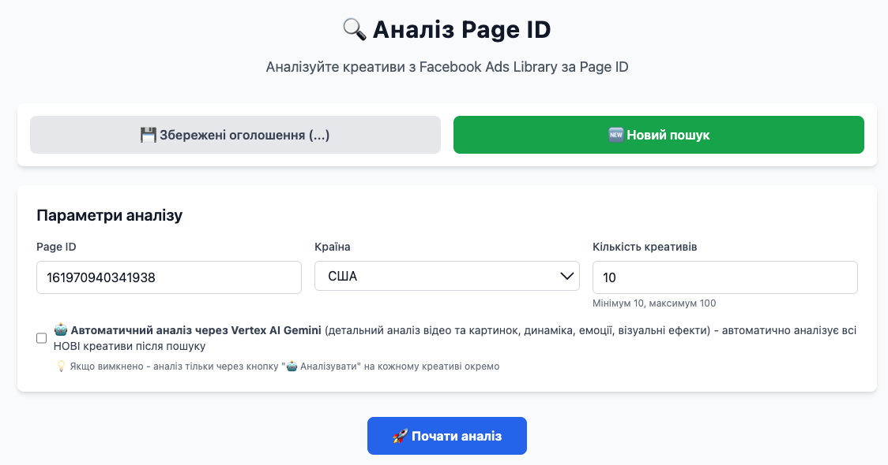

---

### 2. 🤖 AI-Аналіз через Vertex AI

- **Автоматичний режим**: AI аналізує всі нові креативи при скрапінгу
- **Ручний режим**: Кнопка "🤖 Аналізувати" для кожного креативу
- **Multimodal AI**: Підтримка відео та зображень через Gemini 2.0 Flash
- **Cloud Storage**: Тимчасове зберігання медіа у Google Cloud Storage

**Що аналізує AI:**
- 🎯 Ключові повідомлення та цінності
- 🎨 Візуальні елементи та композиція
- 🎬 Структура відео (для відео-креативів)
- 📣 Заклики до дії (CTA)
- 👥 Цільова аудиторія
- ⭐ Унікальні особливості бренду

<!-- SCREENSHOT PLACEHOLDER: Розмістіть скріншот результатів AI-аналізу -->
<!-- Що показати: креатив з розгорнутим AI-аналізом, виділіть основні блоки аналізу -->

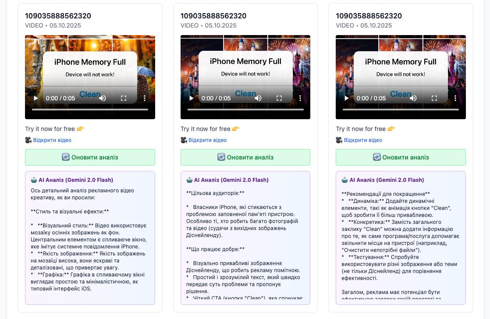

---

### 3. 🪄 Prompt Wizard - Генерація промптів для Kling AI

Інтелектуальна система генерації промптів з **3 режимами роботи**:

#### Режим 1: 💡 Тільки ідея користувача
- Без аналізу трендів конкурентів
- Генерує Kling промпти виключно на основі вашої ідеї
- **Обов'язкове поле**: Ідея креативу

#### Режим 2: 🌍 Всі тренди
- Аналізує тренди з **усіх** Page ID в базі даних
- Опціонально: можна додати власну ідею
- Показує: аналіз трендів + згенеровані промпти

#### Режим 3: 📌 Фіксований Page ID
- Аналізує тренди тільки з **обраного** Page ID
- Випадаючий список з уже проаналізованими Page ID
- Опціонально: можна додати власну ідею

**Результат генерації:**
- 🎬 **Starting Frame**: опис першого кадру для Kling AI
- 🎥 **Final Frame**: опис фінального кадру
- 📝 **Kling Prompt**: готовий промпт для text-to-video
- 💡 **Пояснення**: чому ці промпти будуть ефективні

<!-- SCREENSHOT PLACEHOLDER: Розмістіть скріншот Prompt Wizard -->
<!-- Що показати: інтерфейс вибору режиму, заповнені поля, згенеровані промпти -->

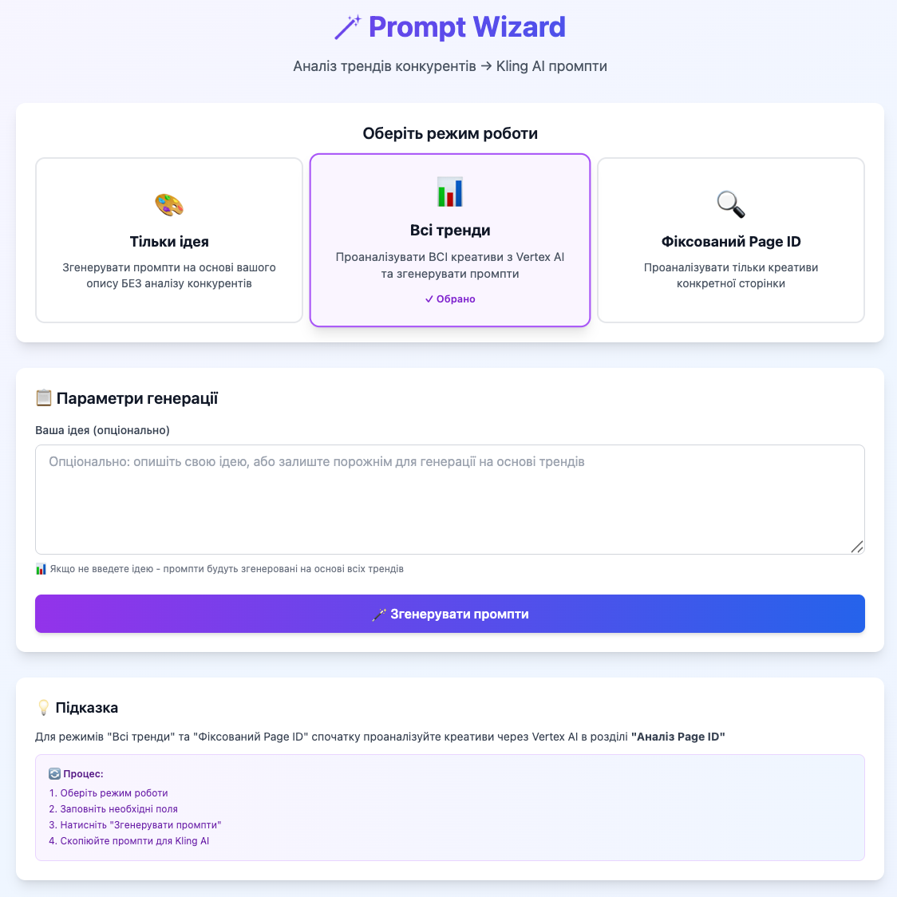

---

### 4. ⚙️ Config - Управління системними промптами

- Редагування системних промптів через UI
- Збереження в Supabase для централізованого управління
- Два ключові промпти:
  - **TREND_ANALYSIS_PROMPT**: для аналізу трендів
  - **KLING_OPTIMIZER_PROMPT**: для генерації Kling промптів

<!-- SCREENSHOT PLACEHOLDER: Розмістіть скріншот Config UI -->
<!-- Що показати: форма редагування промптів, кнопки збереження -->

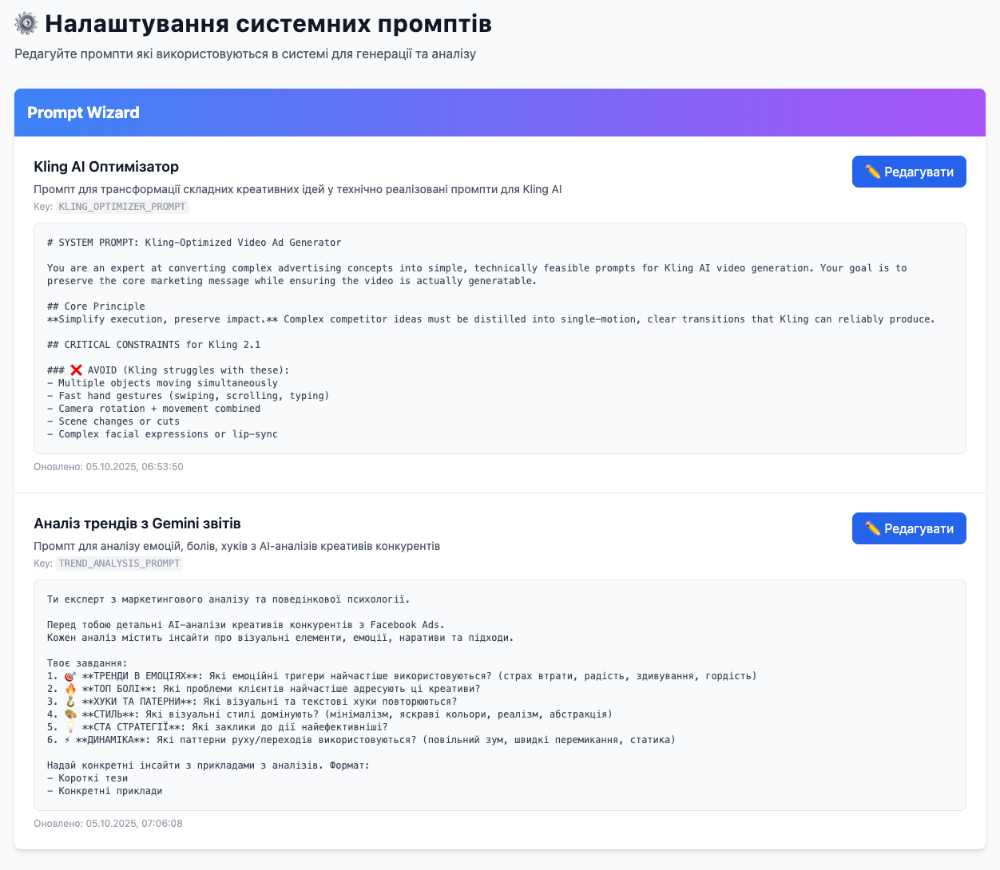

---

## 🛠 Технологічний стек

### Frontend
- **React 18** + **TypeScript** - UI фреймворк
- **Vite** - швидка збірка та HMR
- **TailwindCSS** - утилітарні стилі
- **React Router** - маршрутизація
- **Lucide React** - іконки

### Backend
- **Node.js** + **Express 5** - REST API
- **WebSocket (ws)** - real-time зв'язок
- **@supabase/supabase-js** - взаємодія з БД
- **@google-cloud/storage** - Google Cloud Storage
- **dotenv** - управління env змінними

### Зовнішні сервіси
- **Apify** - парсинг Facebook Ads Library
- **Google Vertex AI** - Gemini 2.0 Flash для multimodal аналізу
- **Claude AI (Anthropic)** - аналіз трендів та генерація промптів
- **Supabase (PostgreSQL)** - база даних
- **Google Cloud Storage** - тимчасове зберігання медіа

### Deployment
- **Railway** - backend хостинг
- **Vercel** (опціонально) - frontend хостинг

---

## 🏗 Архітектура

```
┌─────────────────────────────────────────────────────────────────┐
│                         FRONTEND (React)                         │
│  ┌──────────────┐  ┌──────────────┐  ┌──────────────┐          │
│  │ Competitor   │  │Prompt Wizard │  │   Config     │          │
│  │  Analysis    │  │              │  │              │          │
│  └──────────────┘  └──────────────┘  └──────────────┘          │
└────────────────────────┬────────────────────────────────────────┘
                         │ REST API
┌────────────────────────▼────────────────────────────────────────┐
│                     BACKEND (Express)                            │
│  ┌─────────────────────────────────────────────────────────┐   │
│  │  /api/apify/facebook-ads - Scraping + Auto-analysis     │   │
│  │  /api/facebook-ads - Fetch saved ads                    │   │
│  │  /api/facebook-ads/:id/analyze - Manual AI analysis     │   │
│  │  /api/prompt-wizard/generate - Generate Kling prompts   │   │
│  │  /api/system-prompts - CRUD для промптів                │   │
│  │  /api/analyzed-page-ids - Список Page ID                │   │
│  └─────────────────────────────────────────────────────────┘   │
└───┬────────────┬──────────────┬──────────────┬─────────────────┘
    │            │              │              │
    ▼            ▼              ▼              ▼
┌────────┐  ┌─────────┐  ┌──────────┐  ┌──────────────┐
│ Apify  │  │Supabase │  │ Vertex AI│  │   Claude AI  │
│  API   │  │PostgreSQL│  │  Gemini  │  │  (Sonnet 4)  │
└────────┘  └─────────┘  └──────────┘  └──────────────┘
                              │
                              ▼
                    ┌──────────────────┐
                    │ Google Cloud     │
                    │ Storage (Bucket) │
                    └──────────────────┘
```

---

## 📦 Встановлення

### Передумови

- **Node.js** >= 18.x
- **npm** або **yarn**
- Облікові записи:
  - [Apify](https://apify.com/) (Facebook Ads Scraper)
  - [Supabase](https://supabase.com/) (безкоштовний рівень)
  - [Google Cloud Platform](https://cloud.google.com/) (Vertex AI + Cloud Storage)
  - [Anthropic](https://www.anthropic.com/) (Claude API)

---

### 1️⃣ Клонування репозиторію

```bash
git clone https://github.com/yourusername/GuruTrend.git
cd GuruTrend
```

---

### 2️⃣ Встановлення залежностей

#### Frontend
```bash
npm install
```

#### Backend
```bash
cd backend
npm install
```

---

## ⚙️ Налаштування

### 1. Налаштування Supabase

#### Створення таблиць

Виконайте SQL скрипти у Supabase SQL Editor:

**`database/schema.sql`** (створіть файл з таким вмістом):

```sql
-- Таблиця для запитів до Apify
CREATE TABLE IF NOT EXISTS apify_requests (
  id UUID PRIMARY KEY DEFAULT uuid_generate_v4(),
  page_id TEXT NOT NULL,
  request_date TIMESTAMP DEFAULT CURRENT_TIMESTAMP,
  total_ads_scraped INTEGER DEFAULT 0,
  status TEXT DEFAULT 'completed'
);

-- Таблиця для креативів Facebook Ads
CREATE TABLE IF NOT EXISTS facebook_ads (
  id UUID PRIMARY KEY DEFAULT uuid_generate_v4(),
  apify_request_id UUID REFERENCES apify_requests(id) ON DELETE CASCADE,
  ad_archive_id TEXT UNIQUE NOT NULL,
  page_name TEXT,
  title TEXT,
  caption TEXT,
  media_url TEXT,
  media_type TEXT CHECK (media_type IN ('image', 'video')),
  ad_link TEXT,
  created_at TIMESTAMP DEFAULT CURRENT_TIMESTAMP,
  vertex_analysis TEXT,
  vertex_analyzed_at TIMESTAMP
);

-- Індекси для швидкого пошуку
CREATE INDEX IF NOT EXISTS idx_facebook_ads_page_name ON facebook_ads(page_name);
CREATE INDEX IF NOT EXISTS idx_facebook_ads_ad_archive_id ON facebook_ads(ad_archive_id);
CREATE INDEX IF NOT EXISTS idx_facebook_ads_vertex_analysis ON facebook_ads(vertex_analysis) WHERE vertex_analysis IS NOT NULL;

-- Таблиця для системних промптів
CREATE TABLE IF NOT EXISTS system_prompts (
  id UUID PRIMARY KEY DEFAULT uuid_generate_v4(),
  key TEXT UNIQUE NOT NULL,
  name TEXT NOT NULL,
  description TEXT,
  prompt TEXT NOT NULL,
  category TEXT DEFAULT 'general',
  is_active BOOLEAN DEFAULT true,
  created_at TIMESTAMP DEFAULT CURRENT_TIMESTAMP,
  updated_at TIMESTAMP DEFAULT CURRENT_TIMESTAMP
);

-- Enable Row Level Security (RLS)
ALTER TABLE apify_requests ENABLE ROW LEVEL SECURITY;
ALTER TABLE facebook_ads ENABLE ROW LEVEL SECURITY;
ALTER TABLE system_prompts ENABLE ROW LEVEL SECURITY;

-- Policies для service role (повний доступ)
CREATE POLICY "Enable all access for service role" ON apify_requests FOR ALL USING (true);
CREATE POLICY "Enable all access for service role" ON facebook_ads FOR ALL USING (true);
CREATE POLICY "Enable all access for service role" ON system_prompts FOR ALL USING (true);
```

Потім виконайте файл `database/system_prompts.sql` для заповнення початкових промптів.

---

### 2. Налаштування Google Cloud Platform

#### a) Створення проекту та Service Account

1. Перейдіть на [Google Cloud Console](https://console.cloud.google.com/)
2. Створіть новий проект або оберіть існуючий
3. Перейдіть до **IAM & Admin** → **Service Accounts**
4. Створіть Service Account (наприклад, `vertex-express`)
5. Надайте ролі:
   - **Vertex AI User** (`roles/aiplatform.user`)
   - **Storage Admin** (`roles/storage.admin`)
6. Створіть JSON ключ та збережіть його

#### b) Увімкнення API

```bash
gcloud services enable aiplatform.googleapis.com
gcloud services enable storage.googleapis.com
```

---

### 3. Environment Variables

#### **Backend** (`/backend/.env`)

```env
# Claude API (Anthropic)
CLAUDE_API_KEY=sk-ant-...

# Apify
APIFY_API_TOKEN=apify_api_...

# Supabase
SUPABASE_URL=https://yourproject.supabase.co
SUPABASE_SERVICE_KEY=eyJhbGc...  # service_role key

# Google Vertex AI
VERTEX_AI_PROJECT_ID=your-gcp-project-id
VERTEX_AI_LOCATION=us-central1
VERTEX_AI_CREDENTIALS={"type":"service_account","project_id":"..."}

# Optional: Gemini API (fallback)
# GEMINI_API_KEY=AIza...
```

**Важливо**: `VERTEX_AI_CREDENTIALS` має бути JSON-рядком з вмістом вашого Service Account ключа.

#### **Frontend** (`/.env`)

```env
# Railway backend URL
VITE_RAILWAY_API_URL=https://your-backend.up.railway.app
```

---

## 🚀 Запуск локально

### Frontend
```bash
npm run dev
```
Відкрийте [http://localhost:5173](http://localhost:5173)

### Backend
```bash
cd backend
npm start
```
Backend запуститься на [http://localhost:3000](http://localhost:3000)

---

## 📡 API Документація

### **POST** `/api/apify/facebook-ads`

Запуск парсингу Facebook Ads через Apify

**Request Body:**
```json
{
  "pageId": "161970940341938",
  "useGemini": true
}
```

**Response:**
```json
{
  "success": true,
  "savedCount": 5,
  "duplicatesCount": 2,
  "uniqueAdsCount": 5,
  "newAdsForAnalysis": [
    {
      "id": "uuid",
      "media_url": "https://...",
      "media_type": "image",
      "title": "Ad Title"
    }
  ]
}
```

---

### **GET** `/api/facebook-ads`

Отримати збережені креативи

**Query Parameters:**
- `page_id` (optional): фільтр по Page ID
- `limit` (default: 50): кількість результатів
- `offset` (default: 0): зміщення для пагінації

**Response:**
```json
{
  "ads": [
    {
      "id": "uuid",
      "title": "Ad Title",
      "media_url": "https://...",
      "media_type": "image",
      "page_name": "161970940341938",
      "vertex_analysis": "AI analysis text...",
      "created_at": "2025-01-15T12:00:00Z"
    }
  ],
  "total": 100
}
```

---

### **POST** `/api/facebook-ads/:id/analyze`

Аналіз креативу через Vertex AI

**Request Body:**
```json
{
  "forceReanalyze": false
}
```

**Response:**
```json
{
  "success": true,
  "analysis": "Detailed AI analysis...",
  "cached": false
}
```

---

### **POST** `/api/prompt-wizard/generate`

Генерація Kling промптів

**Request Body:**
```json
{
  "mode": "all_trends",
  "pageId": "161970940341938",
  "userIdea": "Котик рекламує мобільний додаток"
}
```

**Modes:**
- `user_idea`: тільки ідея користувача (без трендів)
- `all_trends`: тренди з усіх Page ID
- `fixed_page`: тренди з конкретного Page ID

**Response:**
```json
{
  "success": true,
  "trendAnalysis": "Detailed trend analysis...",
  "prompts": {
    "startingFrame": "A cute cat sitting next to a smartphone...",
    "finalFrame": "Cat paws tapping on phone screen...",
    "klingPrompt": "Cinematic shot of orange tabby cat...",
    "explanation": "Why these prompts work..."
  },
  "adsAnalyzed": 15
}
```

---

### **GET** `/api/system-prompts`

Отримати всі системні промпти

---

### **PUT** `/api/system-prompts/:id`

Оновити системний промпт

**Request Body:**
```json
{
  "prompt": "Updated prompt text...",
  "name": "New Name",
  "is_active": true
}
```

---

### **GET** `/api/analyzed-page-ids`

Отримати список Page ID з проаналізованими креативами

**Response:**
```json
{
  "pageIds": [
    {
      "page_name": "161970940341938",
      "count": 25
    }
  ]
}
```

---

## 📸 Скріншоти

### Головна сторінка
<!-- SCREENSHOT: Розмістіть скріншот головної сторінки Generation -->
<!-- Що показати: загальний вигляд інтерфейсу, бічне меню, хедер -->

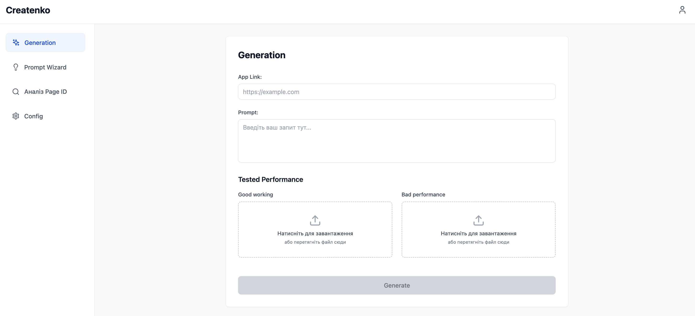

---

### Аналіз Page ID - Пошук креативів
<!-- SCREENSHOT: Форма введення Page ID та результати пошуку -->
<!-- Що показати: введений Page ID, кнопки "Знайти креативи", результати з превʼю креативів -->

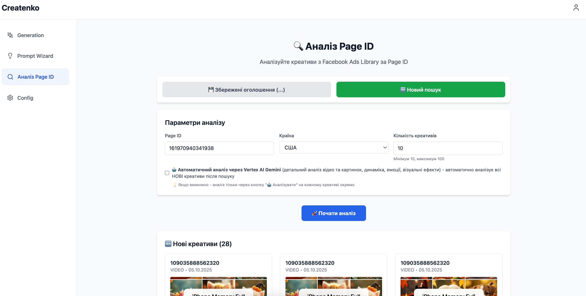

---

### AI Аналіз креативу (Vertex AI)
<!-- SCREENSHOT: Детальний AI-аналіз креативу -->
<!-- Що показати: креатив (відео або зображення), розгорнутий блок з AI-аналізом -->

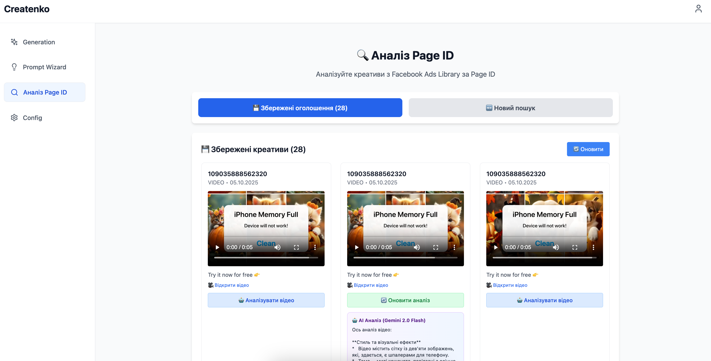

---

### Prompt Wizard - Режим "Фіксований Page ID"
<!-- SCREENSHOT: Інтерфейс з випадаючим списком Page ID -->
<!-- Що показати: dropdown з Page ID, згенеровані промпти на основі конкретного Page ID -->

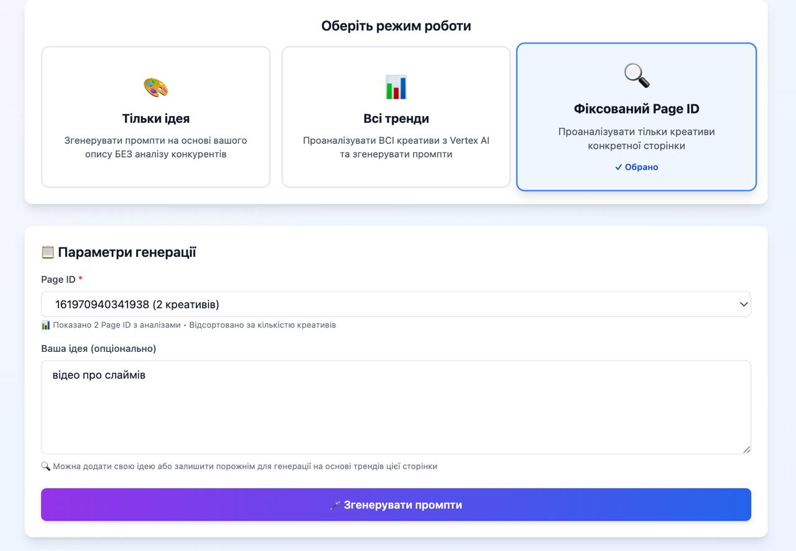

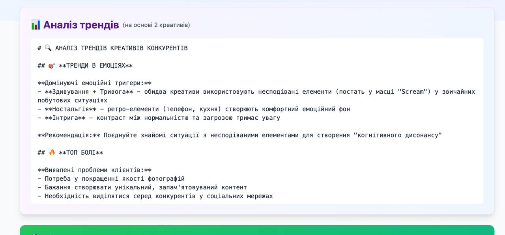

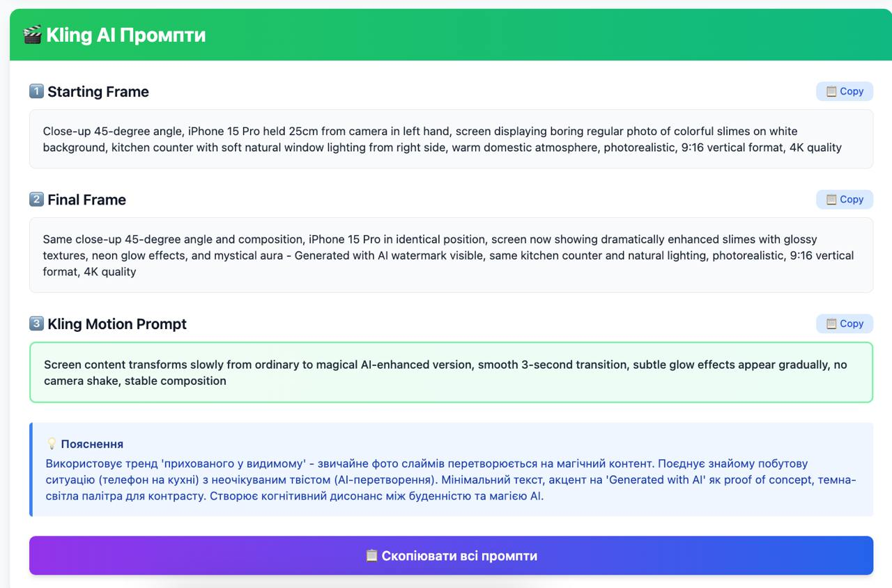

---

### Prompt Wizard - Режим "Тільки ідея"
<!-- SCREENSHOT: Інтерфейс Prompt Wizard у режимі 1 -->
<!-- Що показати: вибраний режим "Тільки ідея", введена ідея користувача, згенеровані промпти БЕЗ аналізу трендів -->

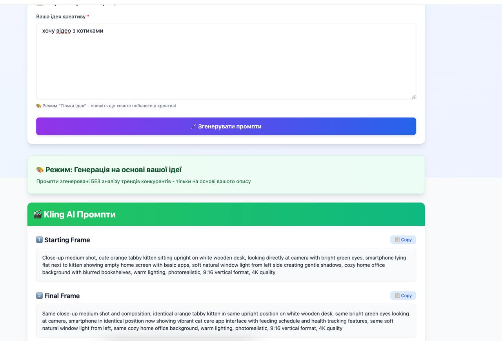

---

### Config - Редагування системних промптів
<!-- SCREENSHOT: UI редагування промптів -->
<!-- Що показати: форма редагування TREND_ANALYSIS_PROMPT та KLING_OPTIMIZER_PROMPT -->

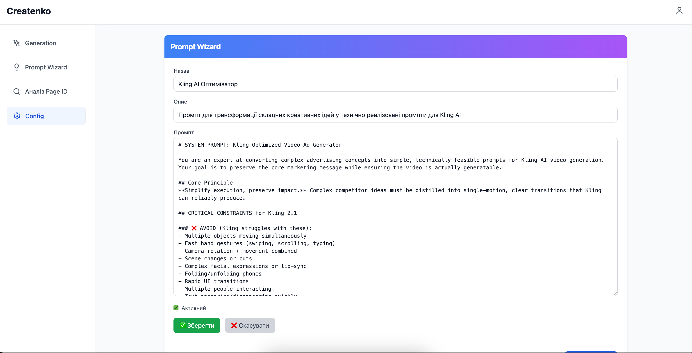

---

## 📁 Структура проекту

```
GuruTrend/
├── backend/                      # Node.js Backend
│   ├── server.js                 # Головний файл Express сервера
│   ├── prompts.config.js         # Fallback системні промпти
│   ├── mcpClient.js              # MCP клієнт (не використовується в продакшн)
│   ├── package.json
│   └── .env                      # Environment variables
│
├── src/                          # React Frontend
│   ├── components/
│   │   ├── Header.tsx            # Хедер з навігацією
│   │   ├── Sidebar.tsx           # Бічне меню
│   │   ├── Layout.tsx            # Загальний layout
│   │   └── FileUpload.tsx        # Компонент завантаження файлів
│   │
│   ├── pages/
│   │   ├── Generation.tsx        # Головна сторінка (не завершена)
│   │   ├── CompetitorAnalysis.tsx # Аналіз Page ID (Facebook Ads)
│   │   ├── PromptWizard.tsx      # Генерація Kling промптів
│   │   └── Config.tsx            # Управління системними промптами
│   │
│   ├── services/
│   │   ├── apifyService.ts       # API сервіс для backend
│   │   ├── claudeApi.ts          # Claude API клієнт (legacy)
│   │   ├── geminiService.ts      # Gemini API клієнт (legacy)
│   │   └── websocketService.ts   # WebSocket клієнт
│   │
│   ├── App.tsx                   # Головний App компонент
│   ├── main.tsx                  # Entry point
│   └── index.css                 # Глобальні стилі
│
├── database/
│   └── system_prompts.sql        # SQL для створення та заповнення БД
│
├── dist/                         # Build output (frontend)
├── docs/
│   └── screenshots/              # Скріншоти для README
│
├── package.json                  # Frontend dependencies
├── vite.config.ts                # Vite конфігурація
├── tsconfig.json                 # TypeScript конфігурація
├── tailwind.config.js            # TailwindCSS конфігурація
├── railway.json                  # Railway deployment config
├── vercel.json                   # Vercel deployment config (optional)
└── README.md                     # Цей файл
```

---

## 🌍 Розгортання

### Backend на Railway

1. Створіть проект на [Railway](https://railway.app/)
2. Підключіть GitHub репозиторій
3. Налаштуйте **Root Directory**: `backend`
4. Додайте Environment Variables з `.env`
5. Railway автоматично визначить Node.js та запустить `npm start`

**Важливо**: Додайте всі змінні з `/backend/.env` у Railway Environment Variables.

---

### Frontend на Vercel (опціонально)

1. Імпортуйте проект на [Vercel](https://vercel.com/)
2. Налаштуйте Build Command: `npm run build`
3. Output Directory: `dist`
4. Додайте `VITE_RAILWAY_API_URL` у Environment Variables
5. Deploy!

---

## 🔒 Безпека

- **Environment Variables**: Ніколи не комітьте `.env` файли
- **API Keys**: Використовуйте `service_role` ключ Supabase тільки на backend
- **CORS**: Налаштуйте CORS тільки для дозволених доменів у продакшн
- **Rate Limiting**: Додайте rate limiting для API endpoints
- **RLS (Row Level Security)**: Увімкнено для всіх таблиць Supabase

---

## 🐛 Troubleshooting

### Проблема: "Invalid API key" від Claude
**Рішення**: Перевірте `CLAUDE_API_KEY` у backend `.env`, має починатися з `sk-ant-`

### Проблема: "Permission denied" від Vertex AI
**Рішення**: 
1. Перевірте ролі Service Account: `Vertex AI User` + `Storage Admin`
2. Переконайтесь що API увімкнені: `aiplatform.googleapis.com`, `storage.googleapis.com`

### Проблема: "Bucket does not exist" (Cloud Storage)
**Рішення**: Backend автоматично створює bucket при першому запиті. Переконайтесь що Service Account має `Storage Admin` роль.

### Проблема: Frontend не може з'єднатися з backend
**Рішення**: Перевірте `VITE_RAILWAY_API_URL` у frontend `.env` та перезапустіть dev server.

---

## 🤝 Внесок

Contributions, issues and feature requests вітаються!

1. Fork проекту
2. Створіть feature branch (`git checkout -b feature/AmazingFeature`)
3. Commit змін (`git commit -m 'Add some AmazingFeature'`)
4. Push до branch (`git push origin feature/AmazingFeature`)
5. Відкрийте Pull Request

---

## 📝 Ліцензія

Цей проект є приватним і не має публічної ліцензії.

---

## 👨‍💻 Автори

- **Mykola Nikitenko**
- **Dmytro Buhaiov**

---

## 🙏 Подяки

- [Apify](https://apify.com/) за Facebook Ads Scraper
- [Anthropic](https://www.anthropic.com/) за Claude AI
- [Google Cloud](https://cloud.google.com/) за Vertex AI та Gemini
- [Supabase](https://supabase.com/) за чудову БД-as-a-Service платформу

---

<div align="center">
  <strong>Made with ❤️ for Creative Marketers</strong>
</div>